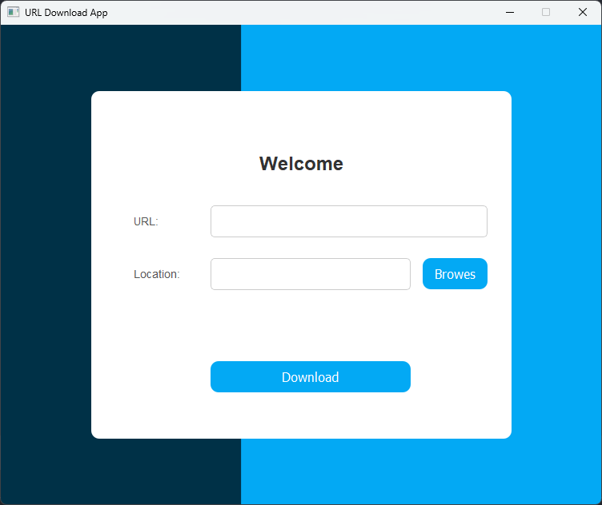
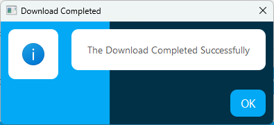

# URL Download App

This project is a simple GUI application built with PyQt5 that allows users to download files from URLs to a specified
location on their local storage. The app extracts media files from URLs, provides a file-save dialog for choosing
download locations, and visually displays download progress.

## Screenshots

### Main Application Window
The main interface allows users to enter a URL, choose a download location, and initiate the download process.



### Success Dialog
Upon a successful download, a dialog appears to notify the user, including a custom success image.



## Features
- **URL Input and Parsing**: Users can enter URLs with or without media file links.
- **File Save Location**: Users can browse their filesystem to select a download location.
- **Progress Tracking**: The app updates a progress bar to track download status.
- **Error Handling**: Handles common errors, such as invalid URLs and download failures, with user-friendly messages.

## How the App was Built
1. **GUI Design**: The GUI was created using PyQt5 Designer. This design includes fields for URL input, location
selection, download initiation, and a progress bar for tracking.
2. **Code Structure**: Core functionality was implemented in Python, using `urllib` for URL handling and downloads,
`pathlib` for path and file extension checks, and `PyQt5` for GUI operations.

## Requirements
- Python 3.10+
- PyQt5

## Installation
To get started, clone this repository, navigate to the project folder, and install the necessary packages:
```bash
git clone https://github.com/Ahmed-A-Kandil/URL-Download-App
cd url-download-app
pip install PyQt5 pyqt5-tools
```

## Running the Application
1. Ensure the `Design.UI` file (created using PyQt5 Designer) is in the project folder.
2. Run the app with the following command:
   ```bash
   python app.py
   ```

## Code Walkthrough

### `class App(QMainWindow, UI)`
This main class initializes the application window and provides all core functionality. It inherits from `QMainWindow`
and the `UI file` generated by PyQt5 Designer.

1. **`__init__(self, parent=None)`**:  
   - Initializes the application window and sets up its appearance (title, fixed size).
   - Connects buttons (`download_button` and `browse_button`) to their respective functions, `download` and `browse`.

2. **`extract_media_url(url: str) -> str`**:
   - Parses the input URL and checks for a `mediaurl` query parameter.
   - If `mediaurl` exists, it returns the extracted media URL; otherwise, it returns the original URL.

3. **`has_extension(file_path: Path) -> bool`**:
   - Checks if the given file path has a file extension. This is useful to avoid saving files without extensions.

4. **`download()`**:
   - Extracts the URL and location input by the user.
   - If the specified location lacks a file extension, it attempts to extract and add the extension from the URL.
   - Clears the URL and location fields after initiating download and updates the progress bar during the download.
   - Displays an information message upon successful download or an error message in case of failure.

5. **`browse()`**:
   - Opens a file dialog to select the location and filename for the download, updating the location input field with
   the selected path.

6. **`handle_progress(block_number: int, block_size: int, total_size: int)`**:
   - Calculates the download progress percentage based on block number, block size, and total file size.
   - Updates the progress bar as the download proceeds.

### `def main() -> None`
This function is the entry point for the application:
   - It initializes the `QApplication` and creates an instance of the `App` class.
   - Opens the main application window and starts the event loop for the app.

---

## Notes
1. **UI Requirements**: Ensure that the `Design.UI` file (generated from the PyQt5 Designer) is in the project root
directory.
2. **File Save Path**: If no extension is provided, the app attempts to extract it from the URL.
3. **Error Handling**: The app provides clear feedback on network or URL issues to ensure a user-friendly experience.

Feel free to explore, modify, and contribute to this project! 

---
